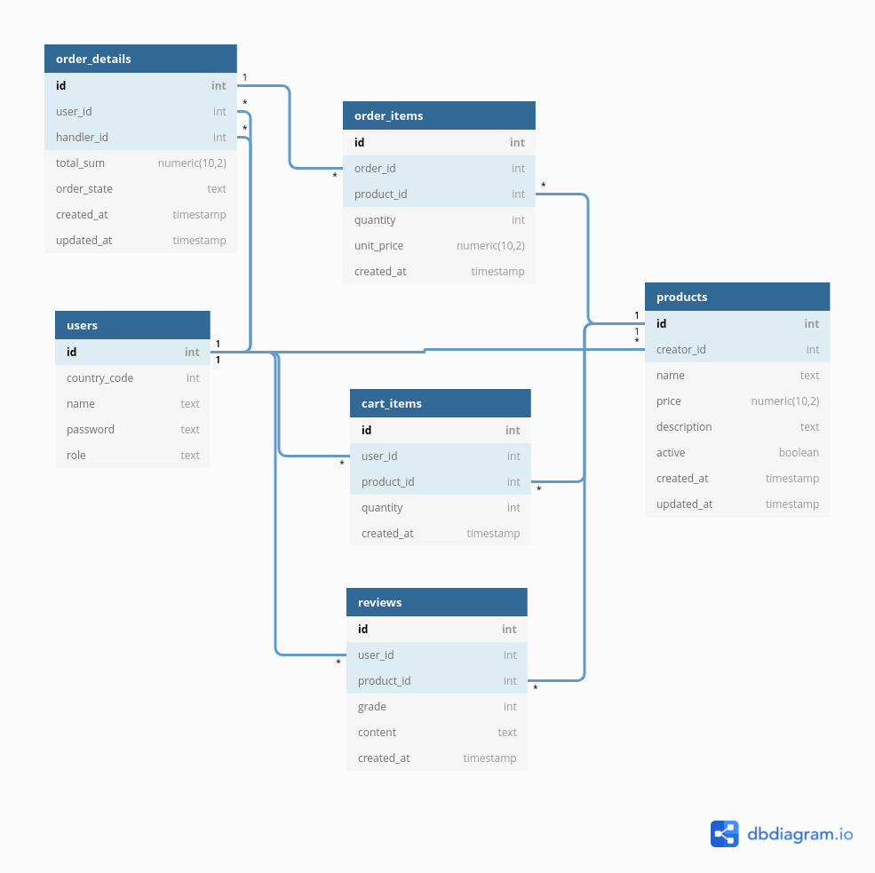

### Tietokanta

#### 2. välipalautus

Versiossa on käytössä 5 tietokantataulua:
- `users` -> käyttäjien tiedot (asiakkaat ja ylläpitäjät)
- `products` -> myytävät tuotteet
- `cart_items` -> ostoskorissa olevat tuoterivit
- `order_details` -> tehdyn tilauksen yleistiedot
- `order_items` -> tilaukseen liittyvät tuoterivit
- `reviews` -> käyttäjien tekemät tuotearvostelut

Ylläpitäjä-roolissa oleva käyttäjä voi luoda uusia tuotteita ja muokata niitä. Normaali käyttäjä voi tarkastella tuotteita
ja lisätä niitä ostoskoriin. Jokaista käyttäjän ostoskorissa olevaa tuotetta vastaa yksi cart_item -rivi, jossa on mm. linkki
tuotteeseen ja kappalemäärä. Jos tuotteita lisätään uudestaan, rivi päivitetään. Jos tuotteet poistetaan korista tai tilaus vahvistetaan,
cart_item -rivi poistetaan kokonaan taulusta.  

`order_details` luodaan tilauksen yhteydessä ja se sisältää tilauksen yleistiedot ja toimii referenssinä yksittäisille riveille.
`order_items` sisältää ns. staattista tietoa, eli kappalemäärän ja yksikköhinnan kyseisestä tuotteesta ostohetkellä, sekä viitteen tuotteeseen.
Näin tehtyjen tilausten tiedot eivät muutu, jos tuotetta myöhemmin päivitetään (esim. hinnan muutos).

Normaalit käyttäjät voivat myös tehdä arvosteluja tuotteisiin.

Relaatioita kuvattu alla:

